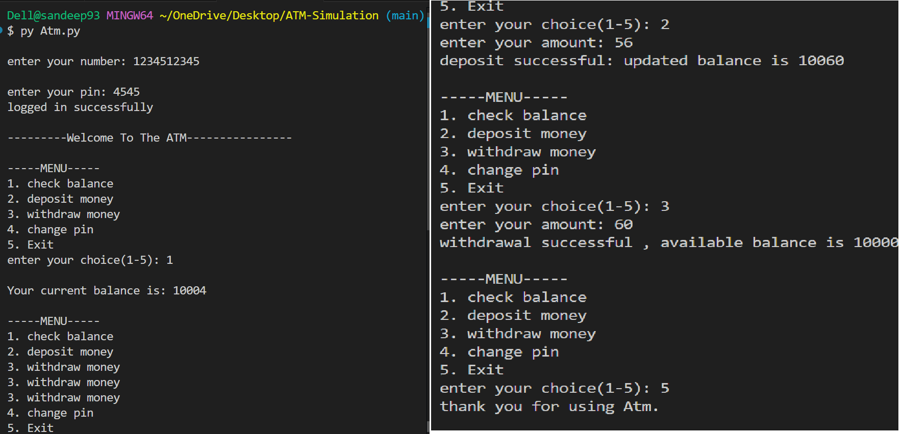

## ATM Management System (Python)

This is a simple ATM simulation program written in Python.
It allows users to log in using an account number and PIN, then perform banking operations like:

1. Checking balance

2. Depositing money

3. Withdrawing money

4. Changing PIN

5. Exiting the system

All data is stored in a CSV file (Data.csv).

📂 Project Structure
ATM_Project/
│
├── atm.py
├── numbers.csv
└── README.md

📄 numbers.csv Format

The CSV file stores data in groups of three values per line:

account_number,pin,balance

Example:
1001,1234,5000
1002,4321,8000

⚙️ Features

✅ Secure login with PIN (3 attempts only)
✅ Balance check
✅ Deposit money
✅ Withdraw money
✅ Change PIN
✅ Auto-save updated balance to CSV file
✅ Menu-driven interface

▶️ How to Run
1️⃣ Make sure Python is installed

Check using:

python --version

2️⃣ Run the program

Open terminal in the project folder and run:

python Atm.py

🧠 How It Works

Program reads all data from numbers.csv

Searches for the entered account number

Allows 3 PIN attempts

After successful login, menu is displayed

All balance changes are written back to the CSV file

⚠️ Limitations

No encryption for PIN (plain text in CSV)

No validation for overdraft withdrawal

Single-user session at a time

Basic error handling

## Author

Sandeep Aanjana

